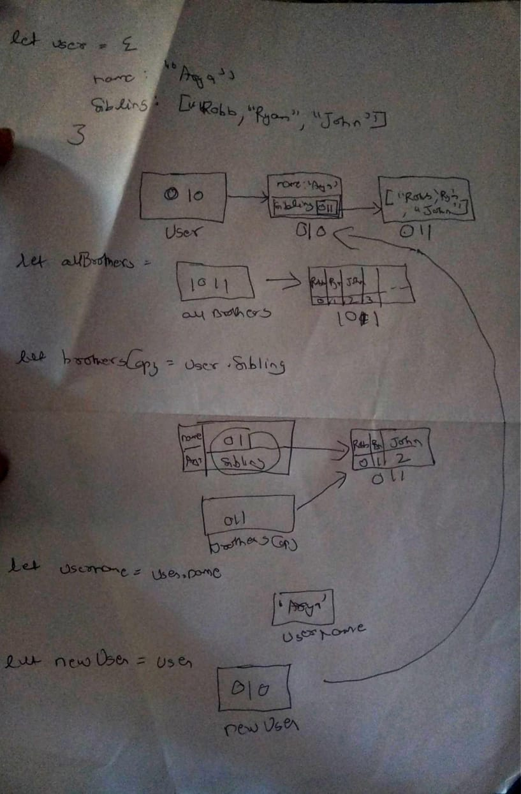

```js
let user = {
	name: "Arya",
	sibling: ["Robb", "Ryan", "John"],
};
let allBrothers = ["Robb", "Ryan", "John"];
let brothersCopy = user.sibling;
let usename = user.name;
let newUser = user;
```

1. Memory representation

-   Create the memory representation of the above snippet on notebook.
-   Take a photo/screenshot and add it to the folder `code`

<!-- To add this image here use  -->



2. Answer the following with reason:

-   `user == newUser;` // true as they are referening to same memory address
-   `user === newUser;` // true as they are referening to same memory address
-   `user.name === newUser.name;` // true as they both have same value here comparsion is done by value of "name"
-   `user.name == newUser.name;` // true as they both have same value here comparsion is done by value of "name"
-   `user.sibling == newUser.sibling;` // true as they both have same value here comparsion is done by value of "sibling"
-   `user.sibling === newUser.sibling;` // true as they both have same value here comparsion is done by value of "sibling"
-   `user.sibling == allBrothers;` // false as here both are non primitive datatype comarsion is done by memory address they don't referning to same address
-   `user.sibling === allBrothers;` // false as here both are non primitive datatype comarsion is done by memory address they don't referning to same address
-   `brothersCopy === allBrothers;` // false as here both are non primitive datatype comarsion is done by memory address they don't referning to same address
-   `brothersCopy == allBrothers;` // false as here both are non primitive datatype comarsion is done by memory address they don't referning to same address
-   `brothersCopy == user.sibling;` // true as in code we had copied a reference of user.sibling which is also non primitive to the a varaible brotherCopy which is true
-   `brothersCopy === user.sibling;` // true as in code we had copied a reference of user.sibling which is also non primitive to the a varaible brotherCopy which is true
-   `brothersCopy[0] === user.sibling[0];` // true here we are comparing value of primitive datatype of both.
-   `brothersCopy[1] === user.sibling[1];` // true here we are comparing value of primitive datatype of both.
-   `user.sibling[1] === newUser.sibling[1];` // true here we are comparing value of primitive datatype of both.
