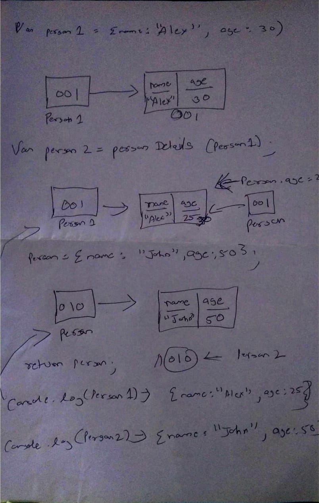

1. What will be the output and explain the reason.

```js
let obj = { name: "Arya" };
obj = { surname: "Stark" };
let newObj = { name: "Arya" };
let user = obj;
let arr = ["Hi"];
let arr2 = arr;
```

Answer the following with reason after going through the above code:

-   `[10] === [10]` // false here we are comparing both non-primitive type but have different memory allocation
-   What is the value of obj? // { name: 'Arya' }
-   `obj == newObj` // false here we are comparing both non-primitive type but have different memory allocation
-   `obj === newObj` // false here we are comparing both non-primitive type but have different memory allocation
-   `user === newObj` // false here we are comparing both non-primitive type but have different memory allocation
-   `user == newObj` // false here we are comparing both non-primitive type but have different memory allocation
-   `user == obj` // true here we are comparing same refernce point.
-   `arr == arr2` // true here we are comparing same refernce point.
-   `arr === arr2` // true here we are comparing same refernce point.

2. What's will be the value of `person1` and `person2` ? Explain with reason. Draw the memory representation diagram.

<!-- To add this image here use  -->

```js
function personDetails(person) {
	person.age = 25;
	person = { name: "John", age: 50 };
	return person;
}
var person1 = { name: "Alex", age: 30 };
var person2 = personDetails(person1);
console.log(person1);
console.log(person2);
```



person1 will have a value to a non-primitive dataType and when we reach to person2 then there personDetails with be called with argument as memory reference of person1 { name: "Alex", age: 30 } and in function the value of age that memory location get updated to 25 so updated object look like { name: "Alex", age: 25 } and then in we are assigning a new non - primitive value to person so here a new memory allocation be given & value will be non-primitive {name: "Alex", age: 30} and then it return reference of newest memory allocation to person2

Then we console.log(person1) which have a updated age value only {name: "Alex", age: 25}

Then we are console.log(person2) which had new memory allocation as because of function body 2nd line so it will have a value of { name: "John", age: 50 }

OutPut - person1 - {name: "Alex", age: 25}
OutPut - person2 - { name: 'John', age: 50 }

3. What will be the output of the below code:

```js
var brothers = ["Bran", "John"];
var user = {
	name: "Sansa",
};
user.brothers = brothers;
brothers.push("Robb");
console.log(user.brothers === brothers); //1. true
console.log(user.brothers.length === brothers.length); //2. true
```
